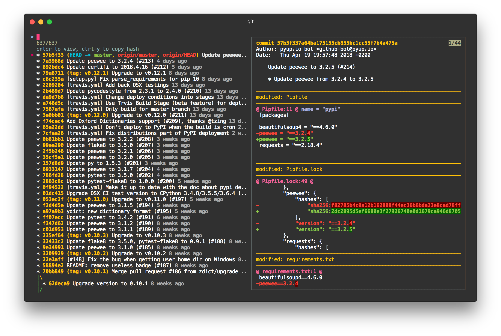

# git ilog

**i**nteracitve git **log** display using [fzf].



this script is based on [example] of fzf, but with these features:

+ supports copy on macOS (`pbcopy`)
+ confiugrable log line format
+ works with [diff-so-fancy] and [emojify] (optional)

[fzf]: https://github.com/junegunn/fzf
[examples]: https://github.com/junegunn/fzf/wiki/Examples#git
[diff-so-fancy]: https://github.com/so-fancy/diff-so-fancy
[emojify]: https://github.com/mrowa44/emojify


## dependency

+ [zsh]
+ [fzf]

[zsh]: http://zsh.sourceforge.net/


## install

simply copy the [git-ilog](./git-ilog) script into some folder in your `$PATH`.


## configure

just config the `ilog.format` like the `log.format` in your `~/.gitconfig`:

```
[ilog]
    format = %C(auto)%h%d %s %C(dim green)%cr%C(reset)
```
